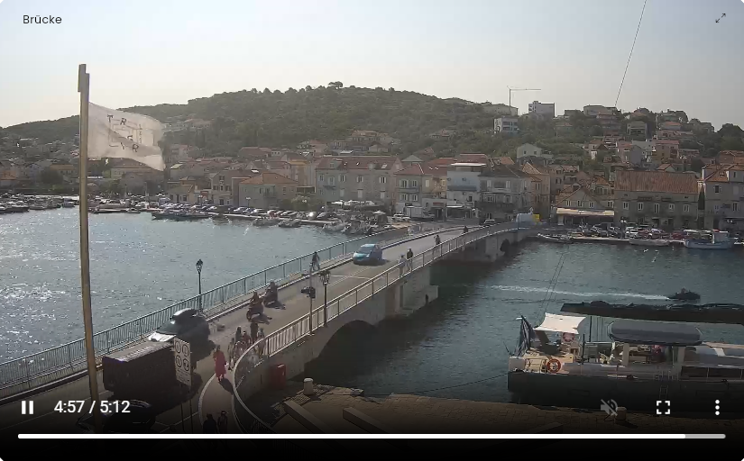

# 📽️ Videoplayer Kachel (Video Player Tile)

[](https://www.symcon.de/service/dokumentation/entwicklerbereich/sdk-tools/sdk-php/)
[](https://www.symcon.de/produkt/)
[](https://github.com/Wilkware/VideoPlayer)
[](https://creativecommons.org/licenses/by-nc-sa/4.0/)
[](https://github.com/Wilkware/VideoPlayer/actions)

Mit diesem Modul können Videos direkt und kachelfüllend in der TileVisu abgespielt werden.



## Inhaltverzeichnis

1. [Funktionsumfang](#user-content-1-funktionsumfang)
2. [Voraussetzungen](#user-content-2-voraussetzungen)
3. [Installation](#user-content-3-installation)
4. [Einrichten der Instanzen in IP-Symcon](#user-content-4-einrichten-der-instanzen-in-ip-symcon)
5. [Statusvariablen und Profile](#user-content-5-statusvariablen-und-profile)
6. [Visualisierung](#user-content-6-visualisierung)
7. [PHP-Befehlsreferenz](#user-content-7-php-befehlsreferenz)
8. [Versionshistorie](#user-content-8-versionshistorie)

### 1. Funktionsumfang

Dank des HTML-SDKs kann dieses Modul Videos nun kachelfüllend darstellen – eine Funktion, die mit der bisherigen HTMLBox nicht möglich war. Die Darstellung entspricht damit der nativen Medienanzeige in Symcon. Es können eine Video-URL hinterlegt, eine Hintergrundfarbe definiert sowie ein optionales Posterbild angezeigt werden. HTML5-Attribute wie autoplay, muted, loop und controls werden unterstützt.

### 2. Voraussetzungen

* IP-Symcon ab Version 8.1

### 3. Installation

* Über den Module Store das 'Videoplayer'-Modul installieren.
* Alternativ über das Module Control folgende URL hinzufügen  
`https://github.com/Wilkware/VideoPlayer` oder `git://github.com/Wilkware/VideoPlayer.git`

### 4. Einrichten der Instanzen in IP-Symcon

* Unter "Instanz hinzufügen" ist das _'Videoplayer'_-Modul unter dem Hersteller _'Geräte'_ aufgeführt.
Weitere Informationen zum Hinzufügen von Instanzen in der [Dokumentation der Instanzen](https://www.symcon.de/service/dokumentation/konzepte/instanzen/#Instanz_hinzufügen)

__Konfigurationsseite__:

_Einstellungsbereich:_

> 📽️ Video ...

Name                              | Beschreibung
--------------------------------- | -------------------------------------------
URL der Medienressource           | Quell-URL des abzuspielendend Videos
Automatisch abspielen             | Video wird automatisch gestartet und abgespielt
Ohne Ton abspielen                | Der Ton vom Video wird ausgeschaltet
Wiedergabe wiederholen            | Das Video wird in einer Endlosschleife wiedergegeben
Bild-in-Bild-Modus deaktivieren   | Steuerelement für PiP wird ausgeschalten
Steuerelemente anzeigen           | Untere Steuerleiste wird angezeigt
Download-Schaltfläche ausblenden  | Das Menü zum Herunterladen wird deaktiviert
HLS-Wiedergabe aktivieren         | Unterstützung für HTTP Live-Streaming

> ✨ Design ...

Name                              | Beschreibung
--------------------------------- | -------------------------------------------
Hintergrundfarbe                  | Hintergrundfarbe des Players
Hintergrundbild                   | Startposter des Players

> ⚙️ Erweiterte Einstellungen  ...

Name                              | Beschreibung
--------------------------------- | -------------------------------------------
Dynamische Änderung der Medien-URL zulassen! | Erlaubt das dynamiche Austauschen der URL-Konfiguration (IPS_SetProperty/IPS_ApplyChanges).

### 5. Statusvariablen und Profile

Es werden keine zusätzlichen Statusvariablen/Profile benötigt.

### 6. Visualisierung

Das Modul kann direkt als Link in die TileVisu eingehangen werden.  
Als Kachel wird der vollflächige Videoplayer dargestellt.

### 7. PHP-Befehlsreferenz

Das Modul stellt keine direkten Funktionsaufrufe zur Verfügung.  
Über IPS_RequestAction mit dem Identifier "SetMediaUrl" und der URL als Wert, kann dem Player mitgeteilt werden das Video zu wechseln!

```php
IPS_RequestAction(int $InstanzID, 'SetMediaUrl', '<neue medien url>');
```

__Beispiel__: `IPS_RequestAction(12345, 'SetMediaUrl', 'https://youtu.be/CKjc1LHNo_w');`


### 8. Versionshistorie

v1.2.20250915

* _NEU_: Projektumstrukturierung hin zu einer globalen CI/CD-Pipeline
* _NEU_: Kompatibilität auf IPS 8.1 hoch gesetzt

v1.1.20250805

* _NEU_: Support HLS (HTTP Live Streaming)

v1.0.20250729

* _NEU_: Initialversion

## Entwickler

Seit nunmehr über 10 Jahren fasziniert mich das Thema Haussteuerung. In den letzten Jahren betätige ich mich auch intensiv in der IP-Symcon Community und steuere dort verschiedenste Skript und Module bei. Ihr findet mich dort unter dem Namen @pitti ;-)

[](https://wilkware.github.io/)

## Spenden

Die Software ist für die nicht kommerzielle Nutzung kostenlos, über eine Spende bei Gefallen des Moduls würde ich mich freuen.

[](https://www.paypal.com/cgi-bin/webscr?cmd=_s-xclick&hosted_button_id=8816166)

## Lizenz

Namensnennung - Nicht-kommerziell - Weitergabe unter gleichen Bedingungen 4.0 International

[](https://creativecommons.org/licenses/by-nc-sa/4.0/)
